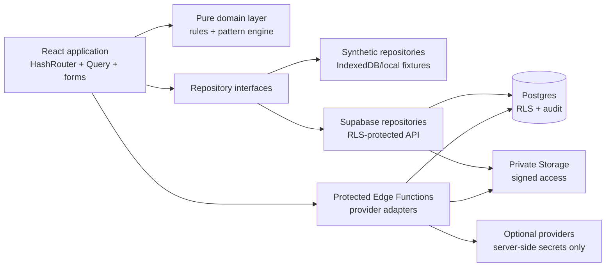
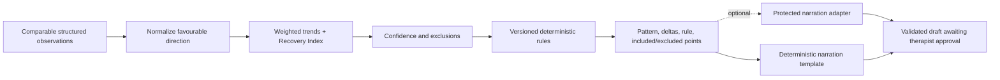

# Architecture

## Purpose and boundaries

AURA is one React application for one dedicated therapist or practice installation. It presents role-controlled therapist and client experiences, but it is not a shared multi-tenant platform and the entrance role choice is never an authorization decision.

The application has two runtime modes:

- **Synthetic demo mode** uses unmistakably fictional fixtures and local persistence. It works without credentials and never implies that data is synchronized.
- **Supabase mode** uses authenticated repository implementations backed by a dedicated Supabase project, database policies, private storage, and protected Edge Functions.

The same domain rules sit above either data implementation. Core client/appointment access and authentication have concrete connected adapters; the published feature screens intentionally remain on the synthetic IndexedDB implementation until each clinical write workflow receives an end-to-end connected adapter and security review. This keeps the credential-free GitHub Pages build useful without presenting local state as synchronized.

## Runtime topology



GitHub Pages serves static assets only. HashRouter keeps application paths after `#`, so a route refresh does not require a server rewrite. Supabase remains the authority for identity, backend roles, record ownership, consent, and connected data access.

## Source layout

The intended feature-oriented layout is:

```text
src/
  app/
    providers/       query, auth, mode, error, and accessibility providers
    router/          route definitions and backend-role guards
    layouts/         public, therapist, client, and session shells
  components/
    design-system/   tokens and reusable surface/form/navigation primitives
    feedback/        status, empty, loading, error, and offline states
    navigation/      role-specific primary navigation
  features/
    auth/ entrance/ today/ clients/ intake/ body-map/
    functional-goals/ appointments/ session/ assessments/
    follow-up/ progress/ insights/ photos/ handoffs/
    consent/ settings/
  domain/
    engine/          pure deterministic pattern calculations
    rules/           caution, consent, bonus-time, and workflow rules
    types/           domain values independent from transport types
    validation/      shared schemas and structured constraints
  data/
    demo/            synthetic fixtures and local repository adapters
    repositories/    interfaces, mapping, and mode composition
    supabase/        client and connected repository implementations
  lib/
    dates/ offline/ security/ formatting/
  styles/            tokens, foundations, motion, and print/export styles
supabase/
  migrations/        ordered, versioned database/storage/RLS changes
  functions/         protected provider-neutral server operations
  seed.sql            synthetic relational fixtures
  tests/              SQL authorization and storage tests
```

Feature folders may contain their own views, components, schemas, hooks, and tests. Reusable visual primitives belong in `components`; cross-feature business rules belong in `domain`; data transport belongs in `data`.

## Dependency rules

Dependencies point inward:

1. UI features may depend on components, domain APIs, repository interfaces, and shared libraries.
2. Repository adapters may depend on domain types and transport clients.
3. Domain code may depend only on other domain code and small general-purpose utilities.
4. Domain code must not import React, browser APIs, Supabase, query clients, or UI text generators.
5. Components and route pages must not issue ad hoc Supabase queries.

This separation matters most for the pattern engine. It receives structured observations and a versioned configuration and returns structured evidence; narration is a separate downstream concern.

## Application composition

The root providers currently compose:

1. the parsed public environment and runtime mode;
2. authentication/session state and protected backend role;
3. TanStack Query and its retry policy;
4. owner-scoped online/offline reconciliation;
5. HashRouter and protected route boundaries.

The repository factory selects demo or Supabase implementations for core client and appointment access. It is intentionally not used to make the remaining demo feature screens appear connected; each additional clinical mutation needs its own contract, invalidation, and authorization review before a production composition can enable it.

Role selection at `/` stores only a visual preference and opens a role-specific login presentation. After authentication, the application loads the protected profile and routes by its backend role. A selected therapist card cannot unlock therapist routes.

## Routes and navigation

Public routes:

- `/`, `/login/therapist`, `/login/client`, `/auth/callback`
- `/handoff/:token`, `/offline`, `/privacy-placeholder`

Therapist routes:

- `/therapist/today`, `/therapist/clients`, `/therapist/clients/:clientId`
- `/therapist/session/:appointmentId`, `/therapist/calendar`, `/therapist/settings`

Client routes:

- `/client/home`, `/client/check-in/:appointmentId`, `/client/progress`
- `/client/history`, `/client/appointments`, `/client/consents`, `/client/settings`

Ordinary therapist work follows the three-screen law: **Today → Clients → Session**. Calendar and settings are contextual extensions, and primary work remains reachable within two interactions.

## Data access

Repository interfaces currently cover core client and appointment records with explicit allowlisted fields and safe mutations. Implementations are selected by the repository factory:

- demo repositories use deterministic fixtures and IndexedDB-backed state;
- Supabase repositories use the publishable client, current authenticated session, and narrow request/cancel database functions for client scheduling.

The synthetic application screens still use the richer demo store for intake, sessions, progress, photos, and handoffs. Those capabilities must gain dedicated repository contracts before connected mode is approved; the application must never label those local mutations as synchronized.

The browser never receives the service-role key. RLS remains in force even if a client route, query key, or browser call is manipulated. Private fields are separated at the schema/view layer instead of being fetched and hidden with CSS.

## Domain engine

The `prototype-v1` engine is pure, deterministic, explainable, and explicitly labelled as not clinically validated. Its processing flow is:



Generative output cannot change the pattern, evidence, numbers, or confidence. It receives only the approved pattern identifier, exact metrics, allowed vocabulary, missing-data statement, and audience. A deterministic template keeps the workflow usable without a provider.

## State, offline, and PWA boundaries

- TanStack Query owns remote server state and invalidation.
- React Hook Form and Zod own editable form state and validation.
- Component state owns transient interaction state.
- A lightweight cross-screen store is appropriate only for local UI state that genuinely spans routes.
- IndexedDB may store synthetic demo state, minimal pending Session Mode state, explicit offline mutations, and non-sensitive preferences.

The service worker caches the application shell and offline route. It must not broadly cache authenticated API responses, access tokens, private photographs, handoff PDFs, or voice notes. Offline mutations carry a unique ID, creation time, retry count, and visible sync state; connected writes should be idempotent where practical.

Session elapsed time derives from a persisted UTC `started_at`, not an incrementing in-memory counter. Refreshes and temporary offline periods therefore do not reset the timer.

## Integrations

Provider-specific services sit behind adapters:

- AI narration → protected `narrate-insight` Edge Function plus deterministic template fallback;
- username sign-in → rate-limited `resolve-username` function that completes Auth without exposing email;
- client/therapist invitations → fresh-auth `admin-users` function, with AAL2 for therapist invitations;
- transcription → protected Edge Function plus fully usable manual note entry;
- notifications → in-app outbox plus later email/push/SMS adapters;
- secure handoff → protected token operations plus authenticated therapist PDF download;
- passkeys and browser notifications → explicit feature flags with accurate unavailable states.

No browser request goes directly to a provider that requires a secret.

## Time and localization

Database timestamps are UTC. Appointment, due-state, and reporting logic uses the practice timezone from configuration; presentation uses the configured locale. Date-only concepts such as date of birth remain date-only and must not be shifted by timezone conversion.

## Accessibility and responsive behavior

Accessibility is architectural, not a late visual pass. Interactive primitives provide keyboard operation, visible focus, screen-reader names, error announcements, minimum 44px touch targets, and reduced-motion alternatives. SVG body regions are focusable labelled controls. Charts have adjacent textual summaries and export-safe fallbacks. Semantic status uses text/icon/pattern as well as color.

Layouts are designed for phone, iPad portrait, iPad landscape, and desktop. Session Mode prioritizes touch ergonomics and privacy-conscious content in a dark treatment-room context; desk experiences use a light editorial context.

## Deployment

CI validates a clean install, lint, strict type checking, unit tests, production build, and Playwright smoke flow. A successful validation run on `main` triggers a separate Pages workflow that rebuilds with the public deployment environment, uploads `dist`, and deploys it using GitHub's official Pages actions. See [GITHUB_PAGES.md](./GITHUB_PAGES.md).

## Architectural decisions that require explicit review

Create a focused design note or update this document before changing any of these:

- authorizing from client-controlled metadata or entrance state;
- introducing a direct page-to-Supabase dependency;
- changing pattern rules, thresholds, or versioning;
- exposing a table, view, storage bucket, or function anonymously;
- adding cached authenticated/private content;
- sending health-related data to a new external provider;
- weakening fresh-authentication or consent gates;
- changing single-practice scope or adding tenant administration.
