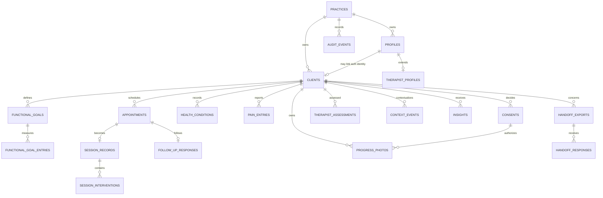

# Data model

## Scope and conventions

The schema models one dedicated practice installation. `practice_id` is retained on practice-owned rows to keep ownership explicit and make a future migration possible; it does not create a shared multi-tenant administration product.

Conventions:

- primary keys are UUIDs generated by the database;
- `profiles.id` is the corresponding `auth.users.id`;
- timestamps are `timestamptz`, stored in UTC, with database defaults where appropriate;
- date-only facts use `date`;
- scores are constrained to `0..10`;
- owned rows have foreign keys, deliberate delete behavior, and useful access-path indexes;
- mutable primary records have `created_at`, `updated_at`, and a shared update trigger;
- sensitive fields are documented with SQL comments and are not returned through client-safe interfaces;
- JSONB is reserved for variable configuration or structured evidence, not as a substitute for core relational fields.

The migration files are the executable authority. This document describes their intended domain and security boundaries.

## Constrained values

| Type                    | Values                                                                                                                            |
| ----------------------- | --------------------------------------------------------------------------------------------------------------------------------- |
| `user_role`             | `therapist`, `client`                                                                                                             |
| `appointment_status`    | `requested`, `pending`, `confirmed`, `completed`, `cancelled`, `declined`                                                         |
| `intake_status`         | `pending`, `partial`, `complete`, `review_required`                                                                               |
| `goal_status`           | `active`, `achieved`, `paused`, `revised`, `archived`                                                                             |
| `consent_type`          | `health_data`, `photography`, `reminders`, `handoff`, `ai_processing`                                                             |
| `insight_status`        | `draft`, `approved`, `rejected`                                                                                                   |
| `pattern_type`          | `building_baseline`, `improving`, `mixed`, `limited_change`, `maintenance`, `sustained_worsening`, `medical_review_consideration` |
| `session_response_type` | `much_better`, `better`, `similar`, `tender_acceptable`, `worse`, `significantly_worse`                                           |
| `body_side`             | `left`, `right`, `central`, `bilateral`, `not_applicable`                                                                         |

Additional status/channel fields should use enums or check constraints when their vocabulary is stable.

## Identity, practice, and presentation

### `practices`

One seeded row for this installation. Contains `id`, `name`, `locale`, `timezone`, `configuration`, `created_at`, and `updated_at`. Configuration is non-secret operational configuration. Practice timezone must be an IANA name.

### `profiles`

Protected application identity for each authenticated user: `id`, `practice_id`, backend-controlled `role`, normalized unique `username`, `display_name`, `avatar_path`, and timestamps. `id` references `auth.users`; roles must never be read from user-editable metadata.

Normalize usernames consistently, constrain the accepted format, and enforce case-insensitive uniqueness. Public username-to-email lookup is prohibited.

### `therapist_profiles`

One-to-one therapist detail: `user_id`, `practice_id`, `professional_name`, contact fields, settings, and reminder preferences. `user_id` references a therapist `profiles` row. Contact and settings are authenticated data, not public brand content.

### `brand_config`

One row per practice: `practice_id`, `logo_path`, `portrait_path`, accent values, typography configuration, `bonus_minutes_label`, quote library, locale, feature flags, and `updated_at`. The base table is authenticated/therapist-managed; private portrait paths, feature flags, quote configuration, and other settings are not anonymous.

### Safe views

`public_brand_config` is the sole anonymous application-data view. Its explicit column list contains practice name, a public-bucket logo path, visual configuration, bonus label, and locale; it omits private assets, feature flags, quote configuration, and practice JSON. `client_therapist_directory` gives authenticated users a same-practice explicit projection of professional name and contact fields. Both views use security barriers and deliberate grants.

## Client and care records

### `clients`

The stable client aggregate root: `id`, `practice_id`, nullable `auth_user_id`, preferred/legal names, email, phone, date of birth, intake status, `active`, `created_by`, and timestamps. The nullable auth link supports invited clients before account creation; when present it is unique. Identifying/contact data is sensitive.

### `appointments`

Links a client and therapist to scheduled work: `practice_id`, `client_id`, `therapist_user_id`, `starts_at`, constrained positive `duration_minutes`, `session_type`, status, intake-status snapshot, `requested_by`, room, and timestamps. Shared calendar projections contain no clinical detail.

Clients do not receive direct insert/update permission on this table. `request_appointment` derives client, practice, requester, intake snapshot, room, and requested status from the authenticated account; `cancel_appointment` can only cancel the caller's own request/pending/confirmed row. Therapist scheduling changes use the therapist-only table policies.

Recommended indexes include `(practice_id, starts_at)`, `(client_id, starts_at desc)`, `(therapist_user_id, starts_at)`, and status/time combinations used by Today.

### `appointment_private_notes`

One-to-one therapist-only extension containing `appointment_id`, `practice_id`, `therapist_scheduling_note`, and `updated_at`. Separating it from `appointments` means client-safe appointment access cannot accidentally select the note.

### `health_conditions`

Structured intake facts: `client_id`, category, body region, condition or procedure, approximate date, clearance status, restrictions, structured metadata, and `active`. These are recorded facts; the system does not derive a diagnosis or invent a restriction.

### `consents`

Versioned consent evidence: `client_id`, consent type, version, `granted`, `granted_at`, `revoked_at`, guardian fields where applicable, and metadata. Constraint logic keeps grant/revocation timestamps coherent. Consent checks consider the latest active decision for the relevant type; revocation must take effect immediately.

### `pain_entries`

Client observations by region and side: `client_id`, optional `appointment_id`, body region, body side, constrained intensity, client trend, descriptors, `recorded_by`, and `recorded_at`. Index by `(client_id, recorded_at desc)` and region/time for graph queries.

### `functional_goals`

One of the client's structured goals: `client_id`, category, preserved client wording, body region, baseline score, importance, target date, limitation factors, status, and timestamps. Revision should preserve history rather than overwrite the meaning of past entries.

### `functional_goal_professional_notes`

One-to-one therapist-only extension containing `goal_id`, `practice_id`, `professional_restriction`, and `updated_at`. Clients can access the goal without receiving the professional restriction.

### `functional_goal_entries`

Time-series ability score: `goal_id`, `client_id`, optional `appointment_id`, constrained score, `recorded_by`, and `recorded_at`. The duplicated client reference is validated against the goal owner and enables direct authorization and time-series indexes.

### `therapist_assessments`

Professional observations: `client_id`, optional `appointment_id`, region, side, optional constrained stiffness and ROM scores, movement name, measurement method, therapist-private note, `recorded_by`, and `recorded_at`. Measurement method is necessary for trend comparability. Client access uses a transformed approved presentation, never this private row directly.

### `context_events`

Non-causal context markers: `client_id`, optional `appointment_id`, event type, description, `occurred_at`, and `recorded_at`. Pattern evidence may report proximity but must not claim that the event caused a change.

## Session and follow-up records

### `session_records`

One session per appointment: `appointment_id`, `client_id`, `therapist_user_id`, start/finish timestamps, booked/actual/confirmed bonus minutes, pressure level, client-visible summary, sync status, and timestamps. Constraints prevent negative durations/bonus values and require finished times after start.

### `session_private_notes`

One-to-one therapist-only extension containing `session_id`, `practice_id`, `therapist_private_summary`, private `voice_note_path`, and `updated_at`. The private summary and voice-object reference are therefore absent from client access to `session_records`.

### `session_interventions`

Ordered structured items: `session_id`, body region, intervention type, pressure level, and non-negative display order. Avoid embedding the full intervention list in JSONB.

### `follow_up_responses`

At most one current response for an appointment/client combination: `appointment_id`, `client_id`, response enum, optional functional goal, optional constrained goal score, optional comment, and `recorded_at`. A missing row means _not received_, never a negative response.

### `notification_outbox`

Provider-neutral delivery request: `client_id`, optional appointment, channel, template key, structured payload, `scheduled_for`, status, and `created_at`. Payload must be minimized and must not carry protected provider secrets. Delivery workers, not the browser, attach provider credentials.

## Progress, insights, and handoff

### `progress_photos`

Metadata only: `client_id`, optional appointment, private `storage_path`, view type, phase, photography consent reference, `created_by`, `captured_at`, and metadata. Photo bytes remain in a private bucket. Names and health details never appear in object filenames.

Database and storage authorization both require active photography consent. Revocation prevents future access while retention/deletion policy is handled explicitly.

### `insights`

Versioned engine output: `client_id`, optional appointment, pattern type, engine version, rule version, confidence, structured evidence, client narration, status, approval actor/time, and timestamps. Evidence stores exact inputs/deltas/exclusions needed to reproduce the classification, not unrestricted client records.

Only a therapist may approve. Clients may read approved client narration and approved safe evidence only.

### `insight_private_narrations`

One-to-one therapist-only extension containing `insight_id`, `practice_id`, therapist narration, optional raw provider response, and `updated_at`. Draft/private text and provider output never need to pass through the client-readable `insights` relation.

### `handoff_exports`

Therapist-reviewed export record: `client_id`, creator, recipient name/organization, purpose, date range, included sections, expiry, status, creation/access/revocation timestamps. Photographs are excluded unless explicitly included and consented.

### `handoff_export_approvals`

Append-only per-export approval evidence. It binds one handoff to the approving client, the active standing-consent record, and immutable snapshots of the exact recipient, organization, purpose, included categories, and maximum expiry. A standing handoff consent alone never authorizes generation or sharing. Fresh client authentication is required to approve or revoke, and any later scope change invalidates release.

### `handoff_secrets`

One-to-one therapist/service-only extension containing `handoff_export_id`, `practice_id`, private storage path, token hash, token creation time, and update time. Store only a cryptographic hash of an opaque handoff token; a client-visible handoff record cannot disclose the object path.

### `handoff_responses`

Structured recipient response tied to `handoff_export_id`, plus `submitted_at`. A response endpoint validates the opaque token server-side and exposes no storage path or unrelated client data.

## Rules and audit

### `knowledge_rules`

Versioned rule configuration: `rule_key`, `rule_version`, enabled flag, structured configuration, source label, reviewed flag, effective date, and retirement date. Rule keys/versions are unique. Changes create a new version; they do not silently rewrite past insight evidence.

### `audit_events`

Append-only safe event metadata: `practice_id`, optional actor, action, resource type/id, safe metadata, and `created_at`. Application users can insert approved events through controlled paths and cannot update or delete them. Database triggers automatically append allowlisted events for client creation, consent decisions, photo create/delete, insight decisions, handoff creation, role changes, session completion, and brand-setting changes; Edge Functions append token/access/invitation events that require server context. Never include passwords, tokens, full narratives, photo URLs, or raw transcripts.

### `auth_rate_limits`

Service-only coarse abuse-protection state for the username resolver: keyed hash, window start, attempt count, and update time. It stores neither raw usernames/emails nor raw IP addresses and is not granted to application roles.

## Relationship overview

## Foreign-key and deletion strategy

- Deleting an auth user must not silently erase care history. Profile/account deactivation and clinical-record retention are separate operations.
- Practice deletion is an explicit privileged operation, not routine application cascade behavior.
- Child measurements may cascade only when their aggregate root is deliberately purged under an approved deletion workflow.
- Appointments, sessions, insights, consent evidence, handoffs, and audit records should normally be retained or soft-invalidated rather than incidentally deleted.
- `SET NULL` is appropriate for optional actor references when retaining the event is more important than retaining an account.
- Storage objects and database metadata require a coordinated deletion operation; neither side should be orphaned silently.

## Authorization helpers

RLS policies should reuse small database functions such as:

- `current_user_role()` — protected role from `profiles`;
- `current_client_id()` — client linked to `auth.uid()`;
- `is_therapist()` — role and dedicated-practice membership;
- `can_access_client(target_client_id)` — therapist practice access or exact linked client;
- `has_active_consent(target_client_id, requested_consent)` — current unrevoked consent.

Any `SECURITY DEFINER` helper must pin `search_path`, fully qualify objects, avoid dynamic SQL, receive the smallest necessary grants, and not expose private lookup behavior to anonymous callers.

## Access intent matrix

| Data group                             | Therapist                                  | Owning client                               | Other client / anonymous                  |
| -------------------------------------- | ------------------------------------------ | ------------------------------------------- | ----------------------------------------- |
| Client identity/intake                 | Manage within dedicated practice           | Read/update permitted own fields            | Denied                                    |
| Appointments                           | Manage                                     | Read own; request permitted slots           | Denied                                    |
| Pain, goal entries, context, follow-up | Read/manage                                | Read and create own allowed rows            | Denied                                    |
| Therapist assessments/private notes    | Manage                                     | Denied; use approved safe presentation      | Denied                                    |
| Insights                               | Create/review/approve                      | Approved client narration only              | Denied                                    |
| Photos                                 | Consent-aware manage                       | Own, consented, fresh-auth application flow | Denied                                    |
| Handoffs                               | Therapist workflow only                    | Consent/status appropriate to own handoff   | Token endpoint exposes only scoped output |
| Audit                                  | Controlled append/read appropriate to role | No raw audit access                         | Denied                                    |
| Public brand projection                | Read                                       | Read                                        | Read only deliberately public fields      |

See [SECURITY.md](./SECURITY.md) for enforcement and required negative tests.
